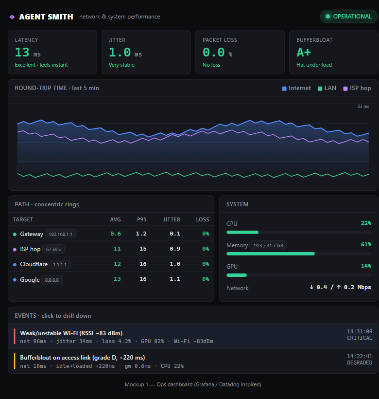
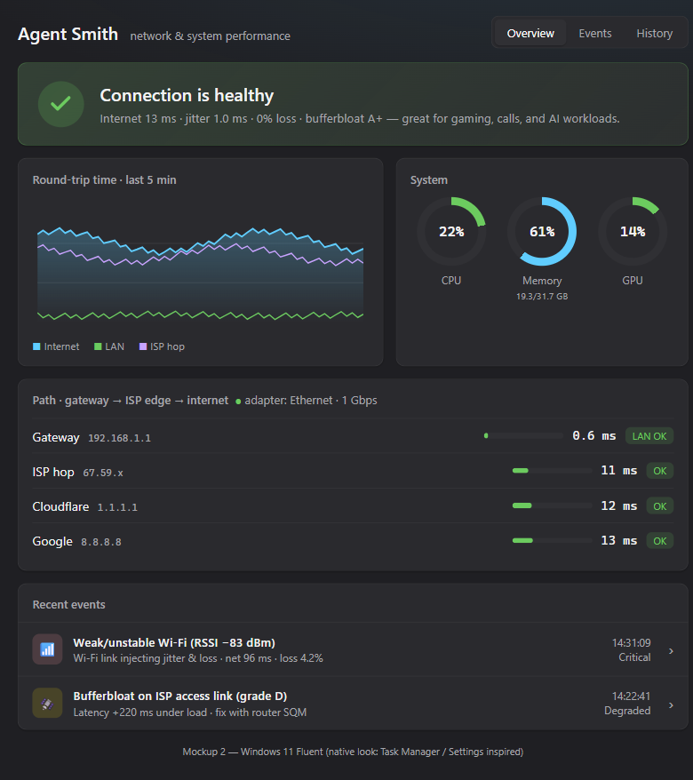
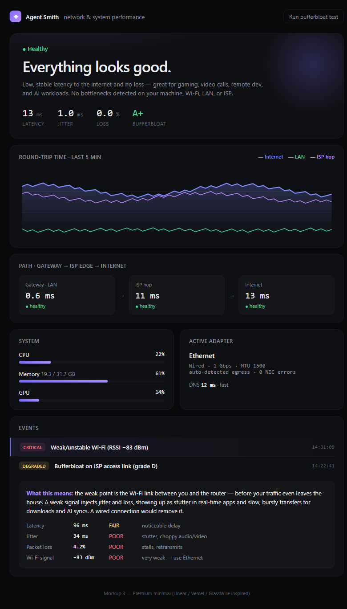

# UI mockups

Three exploratory design directions for the Agent Smith dashboard. Open the
`.html` files in a browser to view them live; the `.png` files are rendered
previews. These are throwaway mockups — the chosen direction gets ported to the
native walk GUI.

| # | Direction | Inspiration | Vibe |
|---|---|---|---|
| 1 | [Ops dashboard](1-grafana.html) | Grafana / Datadog | Dense, data-first: big stat tiles, area chart, tables |
| 2 | [Windows 11 Fluent](2-fluent.html) | Task Manager / Settings | Native Windows: rounded cards, ring gauges, segmented nav |
| 3 | [Premium minimal](3-linear.html) | Linear / Vercel / GlassWire | Spacious, hero status, event drill-down drawer |

